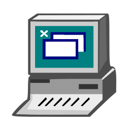

# Bem vindo aos meus projetos VisuAlg! 

### Todos os programas criados aqui foram alguns dos exercícios desenvolvidos durante o meu curso de Algoritmos através da ferramenta VisuAlg.

Tem desde funções simples aos mais detalhados, como até a criação de um Jogo da Velha.  
Para acessá-los basta abrir a pasta
    <a href="https://github.com/GeorgeEnriqueBravo/VisuAlg/tree/main/projetos-visualg" target="_blank">
        projetos-visualg
    </a>
desse repositório e selecionar o arquivo desejado.

---
## Execução

Os programas são todos em extensão `.alg` e para serem abertos é necessário um programa que leia essa extensão.  
Vode pode usar o proprio VisuAlg para isso, baixando ele diretamente do meu repositório se preferir.  
    <a href="https://github.com/GeorgeEnriqueBravo/VisuAlg/raw/main/visualg3.0.7.rar" target="_blank">
        Download VisuAlg
    </a>  
    
Não é necessário instalação, apenas descompacte o arquivo no local desejado e execute o arquivo `visualg30.exe`.  
Com ele aberto você pode clicar na barra de menus acima em "Arquivo/Abrir" e escolher um dos meus projetos para poder visualizá-lo em execução.  

Uma vez abertos, os programas possuem um cabeçalho detalhado quanto a sua função e como o usuário deve proceder para utilizar.
Apertando a tecla F9 do teclado o programa iniciará sua execução. Para encerrar o programa, basta clicar com a tecla ESC do teclado.

---

## Visualg
É um programa gratuito de edição, interpretação e execução de algoritmos, com uma linguagem próxima ao portugol. É um programa de uso e distribuição livres, utilizado em diversas instituições de ensino no Brasil para o ensino de lógica de programação. Para execução dos programas, ele utiliza um console simulando o modo texto do MS-DOS.

 
